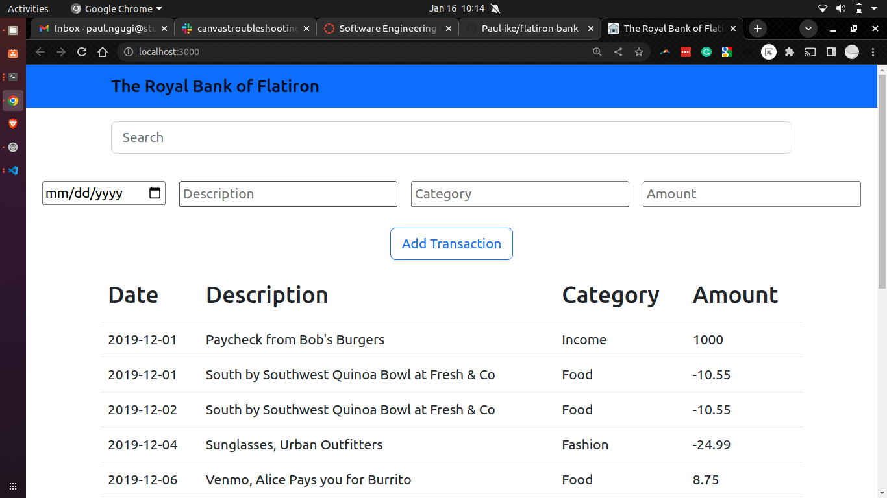
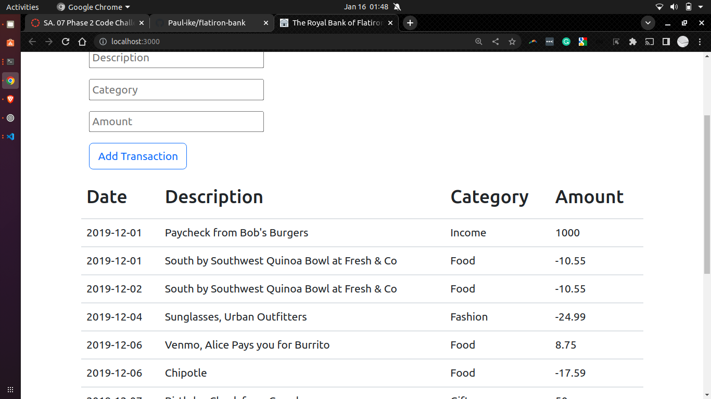

### PHASE 2 CODE CHALLENGE: Bank of Flatiron

#### Project name

    -   The Royal Bank of Flatiron

#### author information

    The following projects are created by:
    -   Paul Wanyoike Ngugi
    -   on 14/01/2023

#### setup/installation requirements

    -   download a zip file under code tab.
    -   extract the downloaded zip folder
    -   open the folder with VS code
    -   Run this command on the terminal on the project directory to get the project application started:
    ```console $ npm install && npm start```
    -   Run this commandcon another teminal on the project directory to get the backend started:
    ```console $ json-server --watch db.json --port 8001```
    -   And the you are good to go.

##### Requirement

    -   Json Server

##### project description

    -   Bank of Flatiron is an app that allows a user to see a list of your recent bank transactions from the app.

##### BDD

    As a user should;
    -   See a list of some of their recent bank transactions when the page loads.
    -   Should create a new bank transactions through a form.
    -   Delete bank transactions they have created.

##### Live Link

    The application is deployed in Github Page
    Here is the link [JsonServer](paul-ike.github.io/bank-flatiron/)

##### Known Bugs

    The application works perfectly well, no bugs.

#### technologies used

    The following projects used the technologies
    :
    -   REACT
    -   JSON

#### Support and Contact information

    Email: paulnyoiken@gmail.com
    Phone: +254718741382

#### License and Copyright Information

Copyright 2021 Paul Wanyoike Ngugi Licensed under[MT License]('https://github.com/Paul-ike/bank-flatiron/blob/main/LICENSE')



